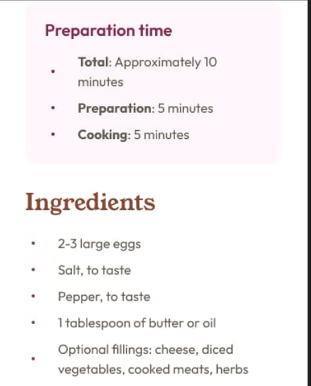

## Table of contents

- [Links](#links)
- [My process](#my-process)
  - [Built with](#built-with)
  - [What I learned](#what-i-learned)
  - [Continued development](#continued-development)
- [Author](#author)

## Links

- Solution URL: [Add solution URL here](https://your-solution-url.com)
- Live Site URL: [Add live site URL here](https://your-live-site-url.com)

## My process

Usually I'll choose a mobile first approach when writing my markup and styles. But after studying the desktop and mobile designs I found that the markup would be the the same regardless of the approach.

I choose to style for desktop at first, but switched to mobile first in the final CSS. The layout and styling were simple enough. However, matching the lists in the designs was a challenge.

When I wrote my markup, I used <ul> and <ol> elements for the lists. And after some research(I asked ChatGPT), I was able to line up the content in the <li> elements with the content in the <h2>/<h3> element and changed the color of the list marker. This worked out great for desktop, but not for mobile as seen below:

The mobile design


My site in responsive mode


I was unable to find a way to achieve the designs using list elements. Eventually, I came up with a solution using <div> elements.

### Built with

- HTML5 markup
- CSS custom properties
- Flexbox

### What I learned

The `list-style-position` property specifies whether the marker(bullents or numbers) should be positioned inside or outside(default value) of a list item.

The default value positions the marker further to the left of the h2/h3 element as seen below:


By setting the value to inside the markers were positioned in line with the preceeding block-level element (<h2>/<h3>) as seen below:


This occurs because when the `list-style-position` is set to `inside`, the marker for each list item is aligned with the start of the list item's text content, which includes any margins applied to the preceding block-level element, in this case, the <h2>/<h3> element.

Note: By default <ul> and <ol> elements have a `padding-inline-start: 40px;`. If this isn't reset the <li> elements will not line up with the <h2>/<h3> elements. They will be positioned further to the right.

The `::marker` sudo-element selector targets the marker of an <li> element in an ordered or unordered list allowing the marker(numbers or bullets) to be styled as seen in the example below:

```css
/* Changes the color of the bullets to red */
ul il::marker {
  color: red;
}
```

### Continued development

While creating the lists using <div> elements worked, I would like to know if there is a way to match the designs using list(<ul>/<ol>) elements.

## Author

- Frontend Mentor - [@jerusalem-dev](https://www.frontendmentor.io/profile/jerusalem-dev)
